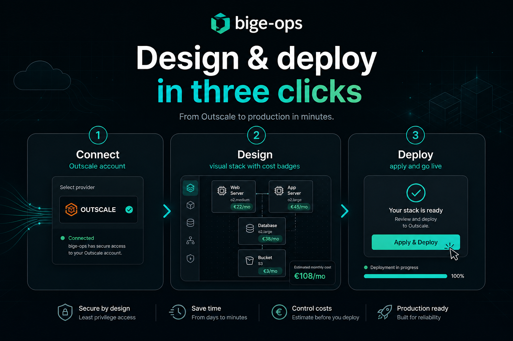
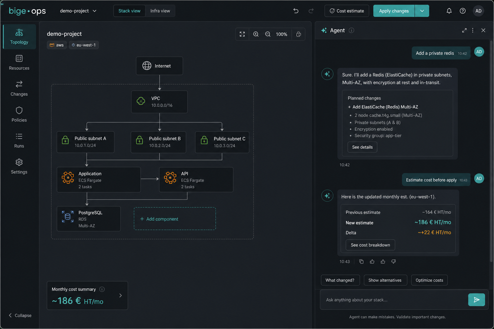
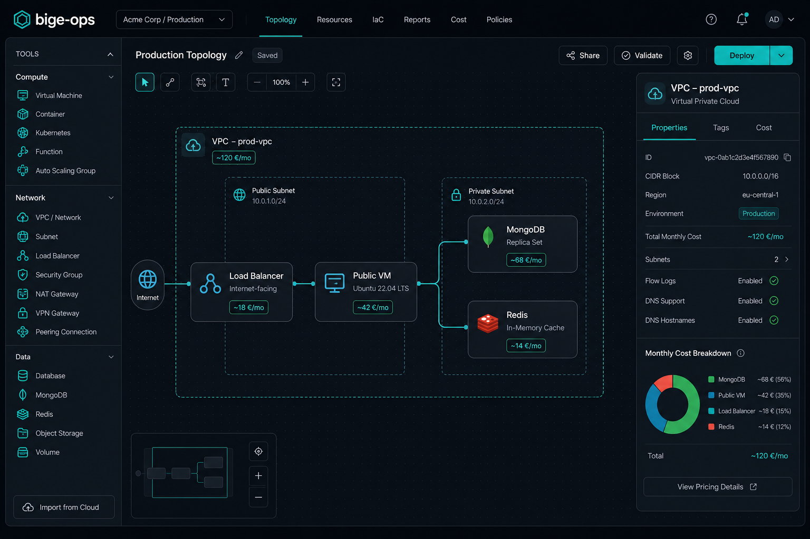

<p align="center">
  
</p>

<h1 align="center">bige-ops</h1>

<p align="center">
  <strong>Free desktop app to understand, simulate, and deploy your Outscale stack</strong><br/>
  Reverse-engineer what’s running · explore costed simulations · apply when you’re ready<br/>
  with an <strong>AI assistant</strong> that helps you design and optimize.
</p>

<p align="center">
  <a href="https://github.com/simondelamarre/bige-ops-releases/releases/latest"></a>
  <a href="#install-macos"></a>
  
</p>

<p align="center">
  <a href="https://github.com/simondelamarre/bige-ops-releases/releases/latest/download/bige-ops-0.2.0-macos-aarch64.dmg"><strong>⬇ Download for macOS (Apple Silicon)</strong></a>
  ·
  <a href="https://github.com/simondelamarre/bige-ops-releases/releases/latest">All releases</a>
</p>

---

## Design & deploy your stack in three clicks

1. **Connect** — link your Outscale account locally  
2. **Design** — reverse-engineer live inventory or sketch a simulation on the Visual canvas  
3. **Deploy** — validate, plan, and apply when the cost looks right  

No Terraform editor. No YAML maze. You work with **ready-to-use simulations** (topology + projected €/month). Terraform and deploy scripts are generated under the hood.

---

## Why teams use bige-ops

| | |
|---|---|
| **AI assistant** | Describe the change in plain language — the agent proposes safe edits, cost impact, and next steps |
| **Live cost badges** | See ~€ HT/month on every component and every simulation while you design |
| **Cost optimization** | Compare draft simulations side-by-side, right-size VMs, cut unused NAT / EIP / volume waste |
| **Reverse engineering** | Fetch inventory from Outscale and rebuild the live stack automatically |
| **Visual topology** | Drag Net, VM, OKS, LBU, volumes… wire the graph, inspect, apply |
| **Safe by default** | Credentials stay on your machine · validate / generate stay local until you choose apply |

---

## AI assistant, front and center

<p align="center">
  
</p>

Ask things like:

- *“Add a private Redis next to the API and show the new monthly cost”*  
- *“Propose a cheaper sizing for staging under 80 €/mo”*  
- *“What’s safe to remove from this live stack?”*

The agent works **with** your Visual graph and Workspace actions — not a disconnected chatbot.

---

## See costs while you design

<p align="center">
  
</p>

- Per-node **€/month** estimates from the public Outscale catalogue  
- Simulation-level totals to compare variants before you touch the cloud  
- Inventory pricing so you know what the live account is already burning  

---

## Features

- **Accounts & workspace** — multi-account Outscale login, local workspace  
- **Inventory sync** — fetch, cost, and import into the live stack  
- **Visual editor** — palette, placement, edges, inspectors  
- **Simulations** — draft variants without mutating production until apply  
- **Plan / apply / deploy** — guided Workspace flow with review dialogs  
- **Embedded CLI** — same `bige-ops` engine as the terminal, bundled in the app  
- **Docs in-app** — FR / EN  
- **Dependency checks** — Terraform, oks-cli, Docker… with install hints  

---

## Install (macOS)

### Option A — Homebrew (recommended)

```bash
brew tap simondelamarre/bige-ops
brew install --cask bige-ops
```

### Option B — DMG

1. Download [`bige-ops-*-macos-aarch64.dmg`](https://github.com/simondelamarre/bige-ops-releases/releases/latest)  
2. Open the DMG → drag **bige-ops** to Applications  
3. First launch: right-click → **Open** (builds are not notarized yet)

### Linux

AppImage / `.deb` on the [latest release](https://github.com/simondelamarre/bige-ops-releases/releases/latest).

```bash
chmod +x bige-ops-*-linux-x86_64.AppImage
./bige-ops-*-linux-x86_64.AppImage
```

---

## Free forever for this desktop build

bige-ops desktop is **free to download**. Your Outscale credentials and simulations stay **local**. Cloud spend is yours — we help you **see it and optimize it** before you apply.

---

## Links

| | |
|---|---|
| **Downloads** | [Releases](https://github.com/simondelamarre/bige-ops-releases/releases) |
| **latest.json** | [Machine-readable index](https://github.com/simondelamarre/bige-ops-releases/releases/latest/download/latest.json) |
| **Homebrew tap** | [homebrew-bige-ops](https://github.com/simondelamarre/homebrew-bige-ops) |

> Source code is private. This repository hosts **public binaries and docs only**.
