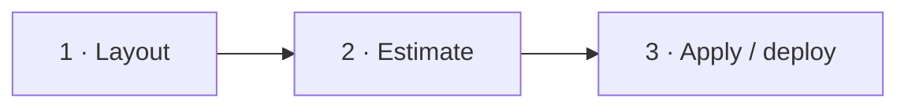

<p align="center">
  
</p>

<h1 align="center">LESS IS MORE</h1>

<p align="center">
  <strong>Free desktop app for <a href="https://www.outscale.com/">Outscale</a> &amp; <a href="https://www.outscale.com/fr/secnumcloud/">SecNumCloud</a></strong><br/>
  Design the stack · see the € · deploy when you’re ready<br/>
  <em>Same engine in the GUI and the CLI. Fully local.</em>
</p>

<p align="center">
  <a href="https://github.com/simondelamarre/bige-ops-releases/releases/latest"></a>
  &nbsp;
  <a href="https://github.com/simondelamarre/bige-ops-releases/releases/latest"></a>
</p>

<p align="center">
  <code>brew tap simondelamarre/bige-ops && brew install --cask bige-ops</code>
</p>

<p align="center">
  <a href="https://bige.dev/"><strong>bige.dev</strong></a> —
  <a href="https://bige.dev/layouts.html">layouts</a> ·
  <a href="https://bige.dev/reseau.html">réseau</a> ·
  <a href="https://bige.dev/oks.html">OKS</a> ·
  <a href="https://bige.dev/secrets.html">secrets</a> ·
  <a href="https://bige.dev/install.html">install</a> ·
  <a href="https://bige.dev/perimetre.html">scope</a>
</p>

---

## Why it exists

Cloud work on Outscale should not start in a blank Terraform folder or a spreadsheet of Tina SKUs.

**bige-ops** is the product you open: compose a **layout**, read an **estimate** (€ HT / month from the public catalogue), then **plan / apply / deploy** on **your** account — VMs, volumes, network, and **OKS** (managed Kubernetes) included.

Terraform, OKS specs, and app YAML are **materialization**. You don’t buy them; `generate` writes them so `oks-cli` / Terraform / kubectl can do the rest.

| | |
|---|---|
| Price of the app | **Free** — Outscale bill stays yours |
| Where it runs | **Your machine** — no SaaS control plane of ours |
| Regions | `eu-west-2` · `cloudgouv-eu-west-1` (**SecNumCloud**) |
| Shape | Visual desktop **or** CLI — one engine |

---

## Three moves



1. **Layout** — pick a starter (language × data × VMs and/or OKS), then edit on Visual or in YAML.  
2. **Estimate** — Tina sizing, OKS control plane + nodepools, volumes, OOS, NAT / LBU / EIP. Indicative € HT / month, not a signed quote.  
3. **Apply** — `plan` then `apply` (`--target oks`, `terraform`, or `all`), then `deploy` for apps on the cluster.

No Outscale account yet (Excel / contract still open)? Stay in **projection mode**: design and estimate offline. Login only when you need inventory, plan, or apply.

---

## Layouts — starters, not a cage

| Runtimes | Data | Topology |
|----------|------|----------|
| Node.js · Python · Java / Spring · Go · Elixir · PHP | MongoDB · Redis · Postgres · Weaviate | IaaS VMs and/or **OKS** |

```bash
bige-ops init -n mon-app --region eu-west-2
# SecNumCloud:
# bige-ops init -n mon-app --region cloudgouv-eu-west-1

bige-ops add layout node-app    # or python-app / java-spring / go-app / …
bige-ops estimate
bige-ops validate && bige-ops generate
```

Change a Tina type or a replica count on Visual — the estimate moves with you.

---

## Money you can defend in a meeting

### Tina

`tinav6.c4r6p2` → generation · **c** = vCores · **r** = RAM GiB · **p** = performance.  
That’s the unit Outscale sells; that’s what we cost.

### OKS — real path, real CLI

Managed Kubernetes is not a slide. Same flow the product uses:

```bash
bige-ops add oks --name main --version 1.30 \
  --nodepool default --node-type tinav6.c4r6p2 --count 3 \
  --control-plane cp.mono.master

# apps on the cluster
bige-ops add stack --topology oks -n app

bige-ops generate
bige-ops plan  --target oks
bige-ops apply --target oks          # oks-cli: project / cluster / nodepools / kubeconfig
bige-ops deploy --stack app          # kubectl apply -f bige-ops/oks/apps/
```

IaaS side: `--target terraform` (or `all`). Estimate rolls up **OKS CP + nodepools** with the rest of the stack.

---

## Local by design

We do not host your workspace. Credentials, designs, and generated artefacts stay on disk.

That is the security model: **protect the workstation**. There is no “our cloud” in the middle.

Optional agent (Claude via your Anthropic API key) can help edit the projection — **WIP**, never required to design or deploy.

---

## Install

| macOS / Linux | [Latest release — FREE](https://github.com/simondelamarre/bige-ops-releases/releases/latest) |
| Homebrew | `brew tap simondelamarre/bige-ops && brew install --cask bige-ops` |
| Gatekeeper (macOS, not notarized yet) | `xattr -cr /Applications/bige-ops.app` then `codesign --force --deep --sign - /Applications/bige-ops.app` |

**Outscale** · [outscale.com](https://www.outscale.com/) · **SecNumCloud** · [outscale.com/fr/secnumcloud](https://www.outscale.com/fr/secnumcloud/)

<p align="center">
  <a href="https://github.com/simondelamarre/bige-ops-releases/releases/latest"></a>
  &nbsp;
  <a href="https://github.com/simondelamarre/bige-ops-releases/releases/latest"></a>
</p>
