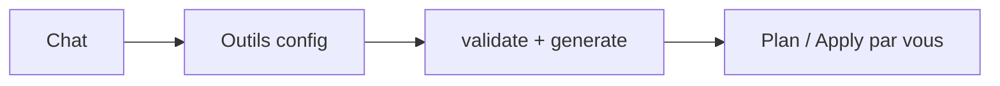

# Assistant IA (agent)

Chat intégré qui manipule la **config** de la simulation. Modèle : **Claude Sonnet 4.5**. Clé API : **la vôtre**, saisie dans Settings, stockée dans `~/.config/bige-ops/settings.json`. Les appels partent du backend local de l’app vers Anthropic — pas de backend bige-ops. Mistral / stack souveraine : prévu, pas encore là.

**Il peut :** lister/créer des simulations, lire le contexte et l’estimation, lister et lire les fichiers, éditer `project.yaml` (update/patch), retirer un composant, ajouter une stack, lancer des commandes CLI en lecture/local (`validate`, `generate`, `estimate --json`, `status`…), lire la doc intégrée, préparer un repo applicatif, lire/écrire un `Dockerfile` et ouvrir une PR.

**Il ne fait jamais :** `apply`, `deploy`, `redeploy`, `github push`, `auth login/logout`, `import selection`, `init --force`. Il ne lit ni n’écrit les fichiers de secrets. Actions sensibles = confirmation explicite dans le chat.

**Repos applicatifs :** écriture limitée à `Dockerfile`, `.dockerignore`, `.bige-ops/*`, sur une branche `bige-ops/*` et via une PR — jamais de commit sur `main`.

**Warn :** l’agent peut se tromper. Co-pilote sur la config, pas opérateur cloud. Relisez avant `plan` / `apply`. Fonction encore WIP, tokens facturés sur votre compte Anthropic.

HTML : [agent.html](https://bige.dev/agent.html)
