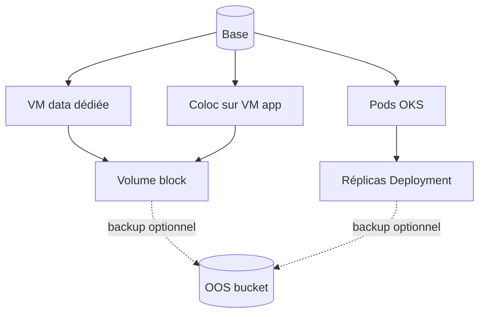

# Bases de données

Postgres, Mongo, Redis (et customs) : choisir **où** ça tourne (coloc VM, VM dédiée, pods OKS), régler réplicas / volumes dans le formulaire — le setup se met à jour **tout de suite**. Kickoff, pas DBA à votre place.

## Coloc vs VM dédiée

**Coloc** = app + data sur la même VM (démarrage). **VM dédiée** = isolement data + volume attaché. Le formulaire Visual réécrit la simulation sans re-interview.

## OKS : réplicas pods

`service_config.*.replicas` scale les Deployments. Ce n’est **pas** un replica-set Mongo / Postgres managé.

## Storage & OOS

Volume / snapshot = filet block. **OOS** = objet S3-compatible pour dumps / backups applicatifs. Voir [oos.md](oos.md).

Pages HTML (diagrammes) : [bases.html](https://simondelamarre.github.io/bige-ops-releases/bases.html) · [oos.html](https://simondelamarre.github.io/bige-ops-releases/oos.html)
