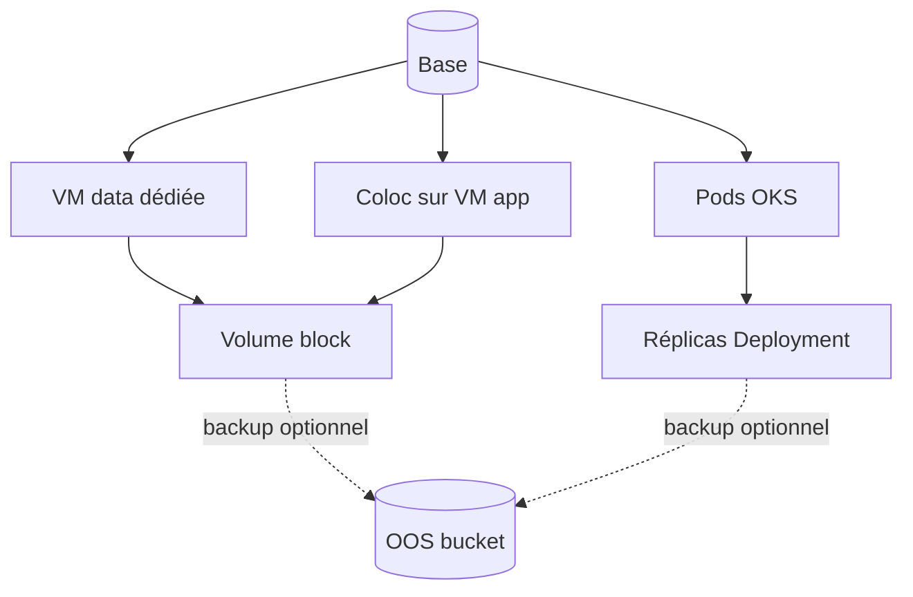

# Bases de données

Postgres, Mongo, Redis (et customs) : choisir **où** ça tourne (coloc VM, VM dédiée, pods OKS), régler réplicas et volumes dans le formulaire — le setup se met à jour **tout de suite**. Le tuning fin et la stratégie de sauvegarde restent les tiens.

```mermaid
flowchart TB
  DB[(Base)]
  DB --> C1[Coloc sur VM app]
  DB --> C2[VM data dédiée]
  DB --> C3[Pods OKS]
  C2 --> VOL[Volume block]
  C3 --> REP[Réplicas Deployment]
  C1 --> VOL
  VOL -.->|backup optionnel| OOS[(OOS bucket)]
  REP -.->|backup optionnel| OOS
```

## Coloc vs VM dédiée

**Coloc** = app + data sur la même VM (démarrage). **VM dédiée** = isolement data, racine `io1` par défaut + volume BSU attaché. Le formulaire Visual réécrit la simulation sans re-interview.

## VM data partagée (multi-VM)

En multi-VM, une petite base peut tourner sur la VM privée d’une autre base au lieu d’avoir la sienne : champ **Machine** de l’inspecteur, ou `service_config.redis.colocate_with: weaviate`. Une VM de moins dans l’estimation ; la VM hôte garde sa taille, ses groupes de sécurité s’additionnent, deploy et backups suivent. La validation refuse deux bases sur le même port (MySQL + MariaDB) ou une VM hôte trop petite pour la mémoire déclarée. Déplacer une base déjà déployée ne copie pas ses données.

## OKS : réplicas pods

`service_config.*.replicas` règle le nombre de pods. Ce n’est pas un replica set MongoDB ni un cluster Postgres répliqué ; les pods de base utilisent `emptyDir`, le filet est le backup vers OOS.

## Storage & OOS

Volume BSU + snapshot = filet bloc. **OOS** = Object Storage compatible S3 pour les dumps applicatifs. Voir [oos.md](oos.md).

Pages HTML (diagrammes) : [bases.html](https://bige.dev/bases.html) · [oos.html](https://bige.dev/oos.html)
