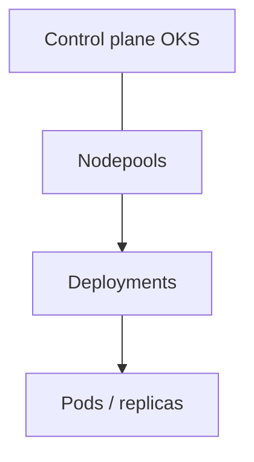

# OKS & pods

Kubernetes managé Outscale : nodepools + Deployments. Réplicas = pods, pas replica-set DB géré.

**Warn :** estimate ≠ contrat. OKS / régions / SecNumCloud pas garantis sur votre tenant — dry run + codes d’erreur API. Contact : [Outscale](https://www.outscale.com/fr/contactez-nous/) · sales@outscale.com.

**App d’abord.** CLI `bige-ops` = même moteur. OKS sous le capot : `oks-cli` + `kubectl`. Voir [cli.html](https://bige.dev/cli.html).

HTML : [oks.html](https://bige.dev/oks.html)
