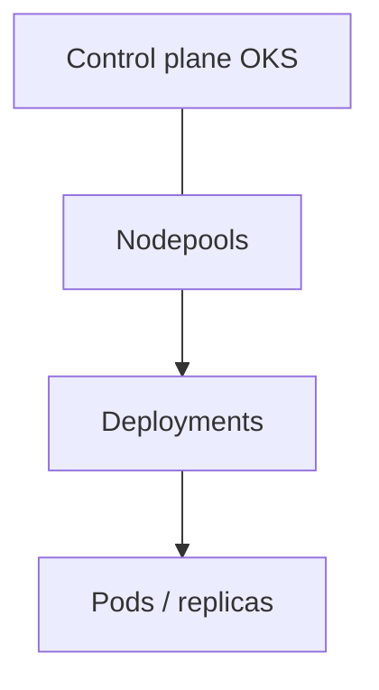

# OKS & pods

Kubernetes managé Outscale : nodepools + Deployments. Réplicas = pods, pas replica-set DB géré.

**App d’abord.** CLI `bige-ops` = même moteur. OKS sous le capot : `oks-cli` (cluster) + `kubectl` (apps). Voir [cli.html](https://simondelamarre.github.io/bige-ops-releases/cli.html).

HTML : [oks.html](https://simondelamarre.github.io/bige-ops-releases/oks.html)
