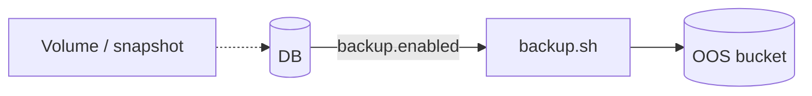

# OOS & backups

**OOS** = Object Storage Outscale (S3-compatible). Bucket + lien backup DB + scripts générés pour **bien démarrer** — PRA / rétention = vous.

Déclarer `oos_bucket`, `generate` → Terraform endpoint régional, apply sur votre compte. Secrets AK/SK hors `project.yaml`.

HTML : [oos.html](https://simondelamarre.github.io/bige-ops-releases/oos.html)
