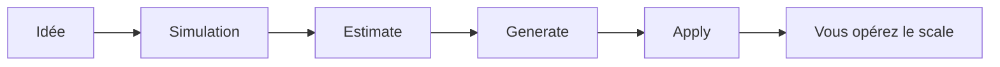

# Périmètre

Kickoff / starter kit Outscale — **pas** une infra qui remplace l’intelligence humaine. **Quand vous scalez, c’est à vous de gérer.**

HTML : [perimetre.html](https://simondelamarre.github.io/bige-ops-releases/perimetre.html)
