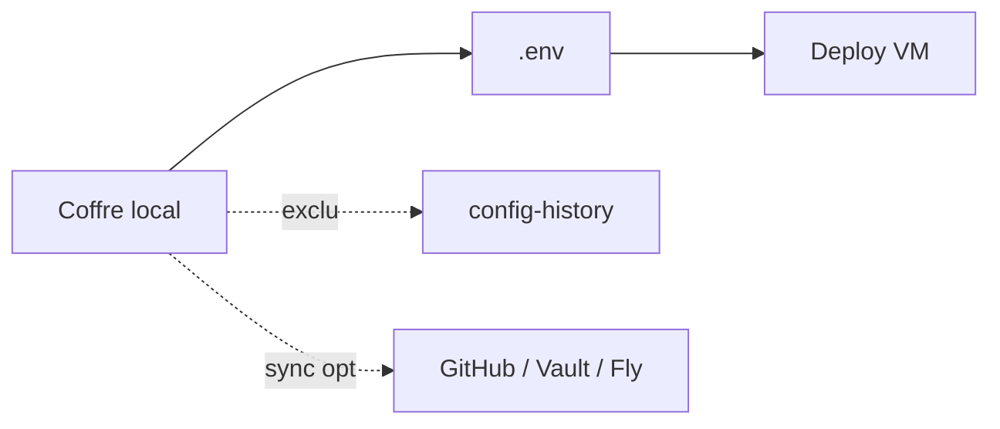

# Secrets, coffre & credentials

**Pas de vault SaaS bige-ops**, aucun backend à nous. Tout est local ; après deploy, les secrets d’exécution vivent côté Outscale / vos VMs.

Où vit quoi :

| Fichier | Contenu |
| --- | --- |
| `accounts/<id>/credentials.local.json` | credentials Outscale du compte (recommandé) |
| `bige-ops/credentials.local.json` | credentials propres à une simulation |
| `credentials.default.json` | credentials partagés (legacy workspace) |
| `bige-ops/vault.local.json` | secrets applicatifs — le « Coffre » |
| `bige-ops/.env` | généré depuis le coffre pour le deploy |
| `bige-ops/terraform/terraform.tfvars` | clés API + `image_id` |
| `bige-ops/**/*.pem` | clés SSH du module keypair |
| `bige-ops/kubeconfigs/` | kubeconfigs OKS |
| `bige-ops/.state/` | hosts.json, statut de deploy, snapshots |
| `~/.config/bige-ops/settings.json` | token GitHub, clé API Anthropic, chemin du workspace |

**Jamais pushé sur le config-history :** credentials, `vault.local.json`, `.env`, `terraform.tfvars`, `*.pem`, `tfstate`, inventaire, `.app-src/`, `.state/`. Le reste de `bige-ops/` est versionné.

`build.secrets` = secrets de build des images Docker, injectés au deploy depuis le coffre.

**Warn :** vos secrets = votre responsabilité. Chiffrez le disque, verrouillez la session.

## Solutions actuelles (`#backends`)

| Backend | Rôle | Statut |
| --- | --- | --- |
| **Local** | Coffre `vault.local.json` → `.env` au deploy | Prêt · primary |
| **GitHub Actions secrets** | Sync vers un repo choisi | Prêt · optionnelle |
| **HashiCorp Vault** | KV sur *ton* Vault (token local) | Prêt · optionnelle |
| **Fly.io secrets** | Secrets d’une app Fly (token local) | Prêt · optionnelle |

Config : `bige-ops/vault.config.json`. Tokens dans Settings desktop. **Pas** de vault SaaS bige-ops.

HTML : [secrets.html#backends](https://bige.dev/secrets.html#backends)
