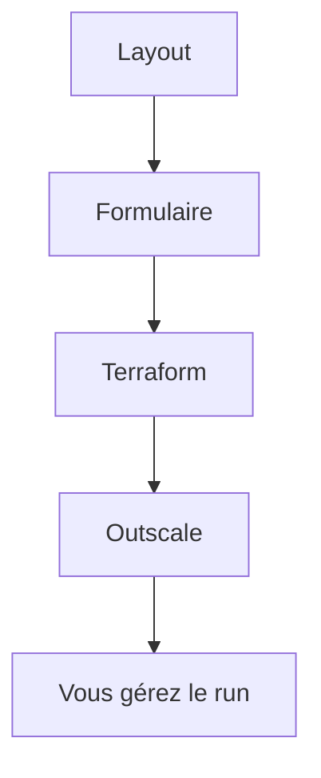

# VMs

Single-vm vs multi-vm, sizing formulaire → generate Terraform → apply. Scale / hardening = vous.

```mermaid
flowchart TB
  L[Layout] --> F[Formulaire]
  F --> TF[Terraform]
  TF --> OSC[Outscale]
  OSC --> RUN[Vous gérez le run]
```

HTML : [vms.html](https://simondelamarre.github.io/bige-ops-releases/vms.html)
